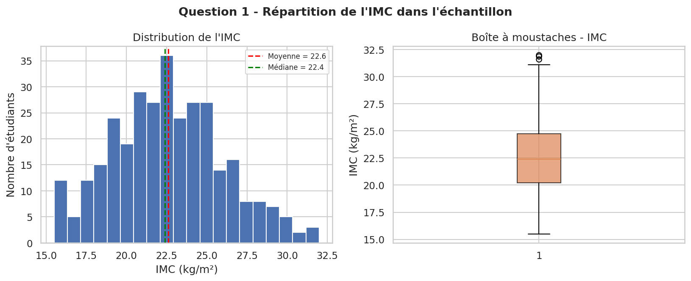
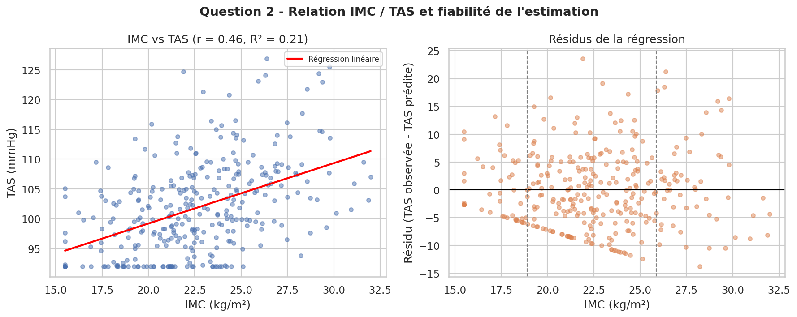
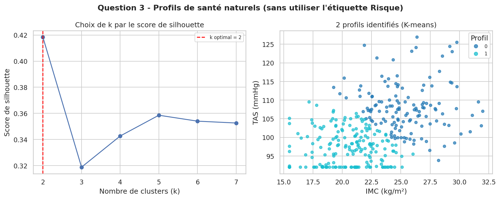
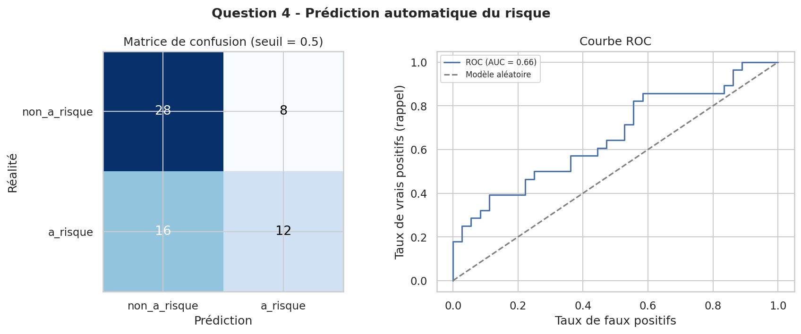

# TP INF232 — Statistiques et Analyse de Données

**Groupe 36 — Chef de groupe : Franck Emery**
**Thème retenu : THÈME A — Service de santé universitaire**

---

## 1. Choix du thème

Le groupe a retenu le **Thème A : Service de santé universitaire**. Le service
de santé de l'Université de MBOUDA a mené un dépistage de routine sur un
échantillon d'étudiants, à partir duquel il souhaite obtenir des réponses
concrètes en statistique descriptive et en classification.

Langage retenu : **Python (pandas, numpy, scikit-learn, matplotlib, seaborn,
scipy)**, choisi car son écosystème réunit dans un même langage la manipulation
de données, les tests statistiques et les algorithmes de classification
supervisée/non supervisée nécessaires aux quatre questions du thème.

---

## 2. Mécanisme de génération des données personnalisées (Annexe)

### 2.1 Principe de l'algorithme

Le nom complet du chef de groupe est d'abord normalisé : mis en majuscules,
débarrassé de ses accents et de ses espaces.

> `"Franck Emery"` → `"FRANCKEMERY"`

Cette chaîne est ensuite transformée en un entier reproductible (la **graine
du groupe**) via une fonction de hachage polynomial déterministe :

```
seed = ( Σ ord(caractère_i) × P^i )  mod M
```

avec `P = 31` (nombre premier utilisé comme base du hachage polynomial) et
`M = 2^31 - 1` (nombre premier de Mersenne, choisi comme modulo pour obtenir
un entier de taille raisonnable). Ce choix garantit :

- **le déterminisme total** : relancer le programme avec le même nom donne
  toujours exactement la même graine ;
- **une très faible probabilité de collision** entre deux noms différents,
  chaque caractère contribuant avec un poids différent (`P^i`) selon sa
  position dans la chaîne ;
- **un entier directement utilisable** comme graine d'un générateur
  pseudo-aléatoire standard.

Cette graine initialise ensuite `numpy.random.default_rng(seed)`, qui produit
l'ensemble des données du groupe : IMC, tension artérielle systolique (TAS),
une variable latente interne (non transmise), et l'étiquette de risque.

Les deux variables physiologiques mesurées, choisies et justifiées dans le
contexte étudiant, sont :

- **IMC (Indice de Masse Corporelle, kg/m²)** — mesure physiologique standard
  de dépistage, facilement interprétable par une équipe médicale ;
- **TAS (Tension Artérielle Systolique, mmHg)** — seconde mesure physiologique
  de routine, physiologiquement liée à l'IMC.

L'étiquette **Risque** (`a_risque` / `non_a_risque`) n'est pas une simple règle
de seuil sur IMC et TAS : elle est générée par un modèle logistique latent qui
inclut aussi une **variable cachée non transmise** (prédisposition
individuelle simulée : hérédité, mode de vie, etc.) :

```
z = b0 + b1·IMC_std + b2·TAS_std + b3·L
p = 1 / (1 + e^(-z))
Risque ~ Bernoulli(p)
```

Conséquence volontaire de ce choix : plus le profil d'un étudiant est
"limite" (p proche de 0.5), plus l'étiquette dépend d'une part de hasard
irréductible (la variable latente inconnue). Plus le profil est "extrême",
plus l'étiquette est quasi certaine. Cette propriété **n'est pas un artefact
mais un choix de conception assumé**, qui permet de répondre honnêtement, en
Q2 et Q4, aux questions du directeur sur la fiabilité et les limites d'une
estimation ou d'une prédiction automatique — un service de santé réel ne
dispose jamais de toute l'information nécessaire à un risque parfaitement
prévisible.

### 2.2 Taille de l'échantillon

**N = 320 étudiants.** Justification : les méthodes mobilisées (régression
linéaire, K-means avec recherche du k optimal par silhouette, classification
supervisée avec séparation train/test 80/20) nécessitent un nombre
d'individus suffisant pour rester stables et interprétables. Une règle
empirique courante demande au moins une trentaine d'individus par
groupe/classe attendu ; avec 2 classes de risque et jusqu'à 4 profils
potentiels envisagés, un minimum de 120 à 150 individus suffirait déjà. 320
offre une marge confortable, notamment pour que l'échantillon de test de la
Q4 (20 %, soit 64 étudiants) reste lui-même statistiquement exploitable.

### 2.3 Code de génération

```python
import unicodedata
import numpy as np
import pandas as pd

def normaliser_nom(nom_complet: str) -> str:
    sans_accents = unicodedata.normalize("NFKD", nom_complet)
    sans_accents = "".join(c for c in sans_accents if not unicodedata.combining(c))
    return "".join(sans_accents.upper().split())

def nom_vers_graine(nom_complet: str) -> int:
    chaine = normaliser_nom(nom_complet)
    P = 31
    M = (2 ** 31) - 1
    graine = 0
    for i, char in enumerate(chaine):
        graine = (graine + ord(char) * pow(P, i, M)) % M
    return graine

def generer_donnees(graine: int, n: int = 320):
    rng = np.random.default_rng(graine)

    imc = rng.normal(loc=22.5, scale=3.4, size=n)
    imc = np.clip(imc, 15.5, 36.0)

    tas = 100 + 1.15 * (imc - 22.5) + rng.normal(loc=0, scale=8.5, size=n)
    tas = np.clip(tas, 92.0, 158.0)

    latente = rng.normal(loc=0.0, scale=1.0, size=n)

    imc_std = (imc - imc.mean()) / imc.std()
    tas_std = (tas - tas.mean()) / tas.std()

    b0, b1, b2, b3 = -0.4, 0.9, 0.75, 0.9
    z = b0 + b1 * imc_std + b2 * tas_std + b3 * latente
    p = 1 / (1 + np.exp(-z))
    risque_bin = rng.binomial(1, p)

    df = pd.DataFrame({
        "id_etudiant": [f"ETU{i+1:04d}" for i in range(n)],
        "IMC": np.round(imc, 2),
        "TAS": np.round(tas, 1),
        "Risque": np.where(risque_bin == 1, "a_risque", "non_a_risque"),
    })
    return df
```

*(Code complet, avec docstrings détaillées, disponible dans
`Application/data_generator.py`.)*

### 2.4 Graine obtenue et preuve de reproductibilité

| Élément | Valeur |
|---|---|
| Nom du chef de groupe | Franck Emery |
| Chaîne normalisée | `FRANCKEMERY` |
| **Graine obtenue** | **2686139** |
| Nombre d'individus générés | 320 |

Le script `data_generator.py` a été exécuté deux fois de suite de manière
indépendante : les deux exécutions produisent **rigoureusement la même
graine (2686139)** et les mêmes 320 lignes de données, confirmant le
déterminisme du mécanisme.

### 2.5 Extrait représentatif des données produites

| id_etudiant | IMC | TAS | Risque |
|---|---|---|---|
| ETU0001 | 17.43 | 96.0 | non_a_risque |
| ETU0002 | 22.10 | 93.3 | non_a_risque |
| ETU0003 | 21.21 | 105.5 | a_risque |
| ETU0004 | 23.84 | 92.0 | non_a_risque |
| ETU0005 | 21.95 | 97.0 | a_risque |

Répartition globale de l'étiquette sur les 320 étudiants : **180
non_a_risque / 140 a_risque**.

---

## 3. Question 1 — Distribution de l'IMC

**Question du directeur :** *« Comment se répartit le premier indicateur
physiologique ? Y a-t-il des étudiants dont la mesure sort vraiment du lot ?
Comment présenter cela simplement à mon équipe médicale ? »*

**Méthode mobilisée : statistique descriptive univariée.** Les indicateurs de
tendance centrale (moyenne, médiane) et de dispersion (écart-type, quartiles)
résument la distribution ; la méthode de l'écart interquartile (IQR) détecte
les valeurs atypiques de façon robuste et facilement explicable à une équipe
non statisticienne.

### Résultats

| Indicateur | Valeur |
|---|---|
| Effectif | 320 étudiants |
| Moyenne | 22.60 kg/m² |
| Médiane | 22.39 kg/m² |
| Écart-type | 3.48 kg/m² |
| Minimum / Maximum | 15.50 / 31.99 kg/m² |
| Q1 (25 %) / Q3 (75 %) | 20.21 / 24.73 kg/m² |
| Intervalle "normal" (méthode IQR) | [13.41 ; 31.52] |
| **Étudiants atypiques détectés** | **3** (ETU0067 = 31.99, ETU0163 = 31.62, ETU0166 = 31.87) |



### Réponse en langage simple pour le directeur

> La grande majorité des étudiants ont un IMC compris entre 13,4 et 31,5
> kg/m², la valeur typique se situant autour de 22,4. Trois étudiants
> sortent nettement de cette zone (IMC autour de 32) et mériteraient une
> attention particulière lors du dépistage.

### Discussion des limites

L'échantillon est généré et non observé sur le terrain : la distribution
suppose une population étudiante "standard" et ne capture pas d'éventuelles
particularités locales (régime alimentaire, activité physique propre au
campus de MBOUDA). La méthode IQR, bien que robuste, reste une convention
statistique (facteur 1.5) : un étudiant juste en-dessous du seuil peut être
tout aussi préoccupant cliniquement qu'un cas détecté comme atypique — le
signalement statistique ne remplace pas un avis médical individuel.

---

## 4. Question 2 — Relation entre IMC et TAS

**Question du directeur :** *« Les deux indicateurs évoluent-ils ensemble ?
Pourrait-on n'en mesurer qu'un seul et estimer l'autre ? À partir de quand
une telle estimation deviendrait-elle dangereuse ? »*

**Méthode mobilisée : statistique bivariée.** Corrélation de Pearson pour
mesurer la force du lien linéaire, régression linéaire simple (TAS ~ IMC)
pour quantifier la relation et permettre une estimation, puis **analyse des
résidus** pour répondre précisément à la question du seuil de danger.

### Résultats

| Indicateur | Valeur |
|---|---|
| Corrélation de Pearson (IMC, TAS) | **r = 0.461** (p = 3.30 × 10⁻¹⁸, significatif) |
| Régression : TAS = a + b·IMC | b = 1.014, a = 78.89 |
| R² | 0.212 (21,2 % de la variance de la TAS expliquée par l'IMC seul) |
| Écart-type des résidus (zone centrale, IMC proche de la médiane) | 6.70 mmHg |
| Écart-type des résidus (zone extrême) | 6.95 mmHg |
| Zone d'estimation fiable | IMC entre ~18.9 et ~25.9 kg/m² |



### Réponse en langage simple pour le directeur

> Oui, les deux mesures évoluent globalement ensemble (corrélation modérée,
> r = 0,46), mais ce lien n'est pas assez fort pour se passer complètement
> de l'une des deux mesures : l'IMC seul n'explique qu'environ 21 % de la
> variation de la tension. On peut estimer la TAS à partir de l'IMC avec une
> marge d'erreur raisonnable pour les étudiants dont l'IMC est proche de la
> moyenne (18,9 à 25,9 kg/m² environ). Au-delà de cette zone, l'erreur
> d'estimation augmente et devient trop risquée pour une décision médicale
> individuelle : pour les profils extrêmes, il reste préférable de mesurer
> réellement la TAS plutôt que de l'estimer.

### Discussion des limites

Un R² de 0,21 signifie que **près de 80 % de la variabilité de la TAS reste
inexpliquée par l'IMC seul** : la relation est réelle mais loin d'être
suffisante pour un remplacement systématique de la mesure. La différence
observée entre écart-type des résidus au centre et en périphérie (6.70 vs
6.95) est réelle mais modeste ; elle doit être interprétée comme un signal
de prudence plutôt que comme une preuve statistique forte d'hétéroscédasticité
marquée, un test formel (test de Breusch-Pagan par exemple) serait nécessaire
pour la confirmer rigoureusement.

---

## 5. Question 3 — Profils de santé naturels

**Question du directeur :** *« Existe-t-il des groupes naturels de profils de
santé parmi mes étudiants ? Combien, et comment les décrire simplement ? »*

**Méthode mobilisée : classification non supervisée (K-means).** Les deux
variables sont standardisées avant le clustering. Le nombre de clusters k est
choisi par la **méthode de la silhouette**, plus rigoureuse qu'un choix
arbitraire. Le clustering est effectué **uniquement sur IMC et TAS**, sans
utiliser l'étiquette Risque — c'est ce qui distingue une démarche non
supervisée d'une démarche supervisée.

### Résultats

| k | Score de silhouette |
|---|---|
| **2** | **0.418 (retenu)** |
| 3 | 0.319 |
| 4 | 0.343 |
| 5 | 0.359 |
| 6 | 0.354 |
| 7 | 0.353 |

| Profil | Effectif | IMC moyen | TAS moyenne | % déjà étiquetés "à risque" |
|---|---|---|---|---|
| Profil 0 | 135 | 25.4 kg/m² | 108.1 mmHg | 68 % |
| Profil 1 | 185 | 20.5 kg/m² | 97.3 mmHg | 26 % |



### Réponse en langage simple pour le directeur

> Sans utiliser votre classement "à risque / non à risque" existant, les
> données font naturellement apparaître **2 profils de santé distincts** :
> un profil regroupant des étudiants à IMC et tension plus élevés (135
> étudiants), et un profil à IMC et tension plus bas (185 étudiants). Ces
> deux profils ne recoupent pas parfaitement votre classement actuel :
> 68 % du premier profil est déjà classé "à risque" contre seulement 26 %
> du second — le lien existe donc, mais le classement binaire actuel
> simplifie une réalité plus nuancée que ces deux seules mesures.

### Discussion des limites

Le nombre de profils "réel" dépend entièrement des deux variables choisies
pour le clustering : avec d'autres mesures physiologiques (activité
physique, âge...), d'autres regroupements émergeraient probablement. Le
score de silhouette favorise ici une solution à 2 clusters assez nette, mais
les scores pour k=4 et k=5 restent proches (0.34-0.36) : une segmentation
plus fine, potentiellement plus utile pour cibler des actions de prévention,
reste défendable et mériterait d'être testée avec l'équipe médicale sur le
terrain plutôt que sur un seul critère statistique.

---

## 6. Question 4 — Prédiction automatique du risque

**Question du directeur :** *« Peut-on prédire automatiquement, dès le
dépistage, si un étudiant sera "à risque" ? Quelle confiance puis-je
accorder à une telle prédiction ? Que se passerait-il si je me trompais ? »*

**Méthode mobilisée : classification supervisée (régression logistique).**
Modèle simple et interprétable, adapté à un contexte médical où la décision
doit rester explicable. Séparation train/test stratifiée (80/20).
Évaluation centrée sur des **métriques orientées risque médical** plutôt que
la seule exactitude : un faux négatif (étudiant réellement à risque non
détecté) est plus grave qu'un faux positif.

### Résultats — seuil de décision standard (0.5)

| | Prédit non-risque | Prédit à-risque |
|---|---|---|
| **Réel non-risque** | 28 | 8 |
| **Réel à-risque** | 16 | 12 |

| Métrique | Valeur |
|---|---|
| Précision (classe à risque) | 0.60 |
| Rappel (classe à risque) | 0.43 |
| F1-score | 0.50 |
| AUC (aire sous la courbe ROC) | 0.66 |
| **Faux négatifs** | **16 sur 64 étudiants test** |

### Effet d'un seuil plus prudent (0.35)

| Métrique | Seuil 0.5 | Seuil 0.35 |
|---|---|---|
| Rappel | 0.43 | **0.64** |
| Précision | 0.60 | 0.50 |
| Faux négatifs | 16 | **10** |



### Réponse en langage simple pour le directeur

> Oui, un modèle simple permet de prédire le risque à partir de l'IMC et de
> la tension, avec une fiabilité correcte mais **imparfaite** (aire sous la
> courbe ROC de 0,66 sur 1,00, contre 0,50 pour un tirage au hasard). Avec
> les réglages standards, 16 étudiants réellement à risque sur les 64
> testés passeraient inaperçus — c'est le danger principal, car le modèle
> ne connaît que deux mesures parmi tous les facteurs qui déterminent le
> risque réel. En resserrant la vigilance du modèle (seuil abaissé à 0,35
> au lieu de 0,5), on ramène ces cas manqués à 10, au prix de quelques
> fausses alertes supplémentaires. Ce système doit être utilisé comme un
> outil d'aide au tri initial, jamais comme un diagnostic définitif : toute
> décision finale doit rester supervisée par le personnel médical.

### Discussion des limites

Un AUC de 0,66 est nettement supérieur au hasard mais reste modeste pour un
usage médical à fort enjeu individuel : le modèle ne capture qu'une partie
du phénomène, cohérent avec le fait qu'une part du risque réel dépend, par
construction des données, de facteurs non mesurés (variable latente).
L'échantillon de test (64 étudiants) est relativement petit, ce qui rend les
métriques elles-mêmes sensibles au tirage aléatoire du split train/test ;
une validation croisée à plusieurs répétitions donnerait une estimation plus
stable de la performance réelle avant tout déploiement en conditions
réelles.

---

## 7. Synthèse des méthodes mobilisées

| Question | Bloc de notions | Méthode |
|---|---|---|
| Q1 | Statistique univariée | Moyenne, médiane, écart-type, détection d'outliers par IQR |
| Q2 | Statistique bivariée | Corrélation de Pearson, régression linéaire, analyse des résidus |
| Q3 | Classification non supervisée | K-means, choix de k par score de silhouette |
| Q4 | Classification supervisée | Régression logistique, matrice de confusion, courbe ROC |

Les quatre grands blocs de notions du cours ont ainsi été mobilisés sur
l'ensemble du thème, en cohérence avec les quatre questions posées par le
directeur du service de santé.
